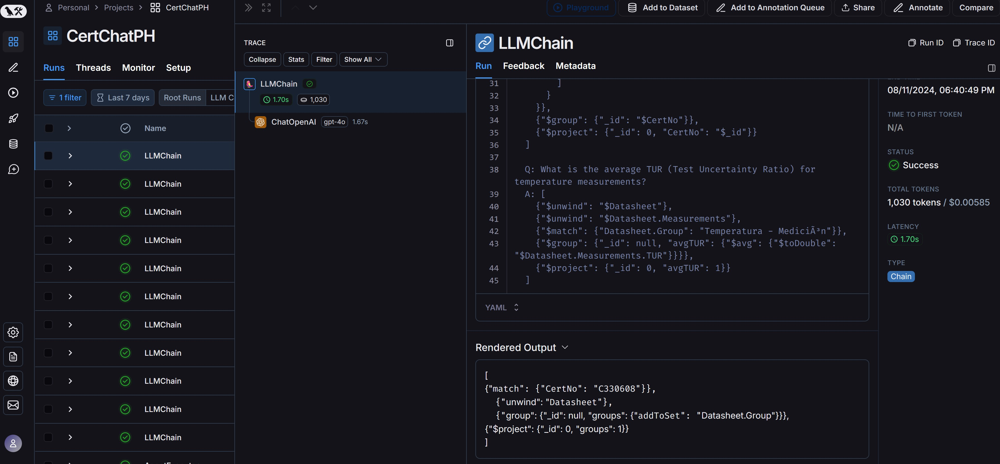

# Calibration Certificate Management System

[](https://www.python.org/downloads/)
[](https://www.mongodb.com/try/download/community)
[](https://streamlit.io/)

## Introduction
The Calibration Certificate Management System is a powerful tool designed to streamline the process of managing and querying calibration certificates. By leveraging advanced technologies such as MongoDB, OpenAI's GPT, and Streamlit, this system provides an intuitive interface for tracking certificate expirations and performing complex queries using natural language.

## Overview
This system is designed to manage and query calibration certificates stored in a MongoDB database. It provides a user-friendly interface built with Streamlit, allowing users to view information about the nearest expiring or most recently expired calibration certificates. The system uses a custom query generator powered by OpenAI's GPT model to convert natural language queries into MongoDB aggregation pipelines.


## Table of Contents

1. [Technologies Used](#technologies-used)
2. [System Architecture](#system-architecture)
3. [Setup and Installation](#setup-and-installation)
4. [MongoDB Configuration](#mongodb-configuration)
5. [Key Concepts](#key-concepts)
6. [Usage Guide](#usage-guide)
7. [File Structure](#file-structure)
8. [Customization and Extension](#customization-and-extension)
9. [Performance Considerations](#performance-considerations)

## Features
- Real-time tracking of certificate expirations
- Natural language querying powered by OpenAI GPT
- User-friendly interface built with Streamlit
- Advanced data analysis using MongoDB aggregation pipelines
- Customizable and extensible architecture

## Technologies Used
- Python 3.8+: Core programming language
- MongoDB 4.4+: NoSQL database for storing certificate data
- Streamlit 1.10+: Web application framework for the user interface
- LangChain 0.0.150+: Framework for developing applications powered by language models
- OpenAI GPT-3.5: Advanced language model for natural language processing
- PyMongo 3.12+: MongoDB driver for Python

## System Architecture
The system is built on a modular architecture:

1. **Data Layer**: MongoDB database storing calibration certificate data.
2. **Backend Logic**: Python scripts handling data retrieval and processing.
3. **Query Generation**: LangChain and OpenAI GPT for natural language to MongoDB query conversion.
4. **User Interface**: Streamlit-based web interface for user interaction.

## Prerequisites
Before setting up the system, ensure you have:
- Python 3.8 or higher installed
- A MongoDB Atlas account or a local MongoDB server
- An OpenAI API key

## Setup and Installation

1. Clone the repository:
   ```
   git clone https://github.com/your-repo/calibration-certificate-system.git
   cd calibration-certificate-system
   ```

2. Create a virtual environment:
   ```
   python -m venv venv
   source venv/bin/activate  # On Windows use `venv\Scripts\activate`
   ```

3. Install dependencies:
   ```
   pip install -r requirements.txt
   ```

4. Set up environment variables:
   Create a `.env` file in the root directory with the following content:
   ```
   MONGODB_URI=your_mongodb_connection_string
   OPENAI_API_KEY=your_openai_api_key
   ```

5. Configure the MongoDB schema:
   - Edit the `prompt.txt` file to match your desired schema structure.
   - Update the `sample.txt` file with corresponding example queries.

6. Start the application:
   ```
   streamlit run main.py
   ```

## MongoDB Configuration

1. Create a MongoDB Atlas account or set up a local MongoDB server.
2. Create a database named `calibration_database`.
3. Create a collection named `calibration_data`.
4. Import your calibration certificate data into the `calibration_data` collection.

Note: To change the schema loaded in MongoDB, you only need to update the schema description in the `prompt.txt` file. This file, along with `sample.txt`, defines how the system interprets and queries your data.

## Key Concepts

1. **Certificate Expiration Tracking**: The system tracks both upcoming and expired certificates, prioritizing the display of the nearest expiring certificate.

2. **Natural Language Querying**: Utilizes OpenAI's GPT model to interpret natural language questions and generate corresponding MongoDB queries.

3. **MongoDB Aggregation Pipelines**: Complex queries are constructed as a series of data processing stages, allowing for sophisticated data analysis and transformation.

4. **Real-time Data Processing**: The system performs real-time calculations to determine the days until expiration or days since expiration for each certificate.

5. **Modular Design**: The system is built with separate modules for data loading, query generation, and UI rendering, allowing for easy maintenance and scalability.

## Usage Guide

1. Start the Streamlit app:
   ```
   streamlit run main.py
   ```

2. The main interface will display:
   - Quick Information panel showing the nearest expiring or most recently expired certificate.
   - A text input for entering natural language queries about the certificates.

3. Enter questions in natural language, such as:
   - "What is the average environmental temperature across all certificates?"
   - "How many certificates are there for each equipment type?"
   - "What are the top 5 manufacturers with the most certificates?"

4. The system will process your query, generate a MongoDB aggregation pipeline, execute it, and display the results.

Here's an example of the system in action:


The results are accurately reflected in the MongoDB database:


LangSmith provides detailed analytics on query performance:



Examples of complex queries the system can handle:
- "Show me the distribution of calibration due dates for each manufacturer over the next 6 months."
- "What is the correlation between environmental temperature and measurement uncertainty across all certificates?"
- "Identify any trends in the 'AsFound' vs 'AfterAdjustment' measurements for a specific equipment type over the last year."

## File Structure

- `main.py`: Main entry point and Streamlit app setup.
- `utils.py`: Utility functions for data processing and certificate queries.
- `ui_components.py`: UI rendering functions and custom Streamlit components.
- `query_generator.py`: Natural language to MongoDB query conversion logic.
- `config.py`: Configuration and environment variable management.
- `data_loader.py`: MongoDB connection and data loading functions.
- `prompt.txt`: Instructions for the GPT model on query generation.
- `sample.txt`: Sample questions and queries for few-shot learning.
- `tests/`: Directory containing unit and integration tests.

## Customization and Extension

- To add new query types, update the `prompt.txt` and `sample.txt` files with new examples.
- For UI modifications, edit the `ui_components.py` file and the CSS styles within.
- To change the database schema, update the schema description in `prompt.txt` and adjust the sample queries in `sample.txt` accordingly.

## Performance Considerations
- For large datasets, consider implementing pagination in query results.
- Use MongoDB indexes to optimize frequent queries.
- Implement caching for commonly accessed data to reduce database load.
- Monitor and optimize slow-running queries using MongoDB's built-in profiling tools.
- Regularly review LangSmith analytics to identify and optimize high-latency or costly queries.

## License
This project is licensed under the MIT License. See the `LICENSE` file for details.

For any additional questions or support, please open an issue on the GitHub repository or contact the maintainers directly.